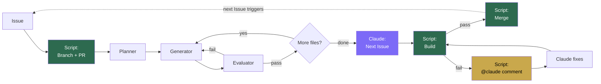
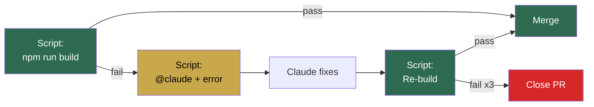
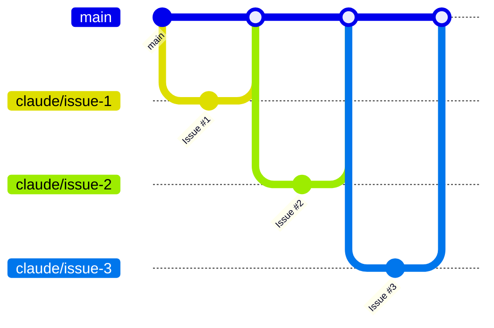

# Architecture

## Flow

Green = shell script (guaranteed). Purple = Claude. Yellow = build fix loop.

## Two jobs

| Job | Trigger | Purpose |
|-----|---------|---------|
| `implement` | Issue created | Branch, PR, implement, build, merge |
| `fix` | PR comment with `@claude` | Fix build failures, re-verify, merge |

## Next Issue creation

Claude creates the next Issue (actor = `claude[bot]`), which triggers the `implement` job.

`GITHUB_TOKEN` cannot trigger workflows on the same repo (GitHub recursion prevention).
Only `claude[bot]` as actor can trigger the next cycle.

## Build fix loop

3 build failures = PR closed (prevents infinite retry).

## Script vs Agent

| Step | Owner | Guaranteed? |
|------|-------|-------------|
| Branch + PR creation | Script | Yes |
| @claude injection | Script | Yes |
| Planning | Planner agent | Best effort |
| Implementation | Generator agent | Best effort |
| Code review | Evaluator agent | Best effort |
| Next Issue creation | Claude (claude[bot]) | Best effort |
| Build verification | Script | Yes |
| Build fix request | Script | Yes |
| Auto-merge | Script | Yes |
| Retry limit (3x) | Script | Yes |

## Branch strategy

Each Issue = one branch = one PR.

