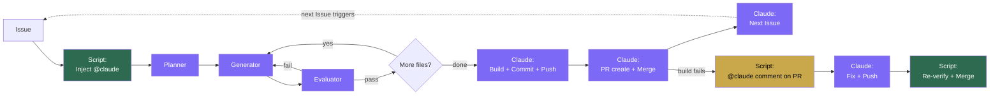
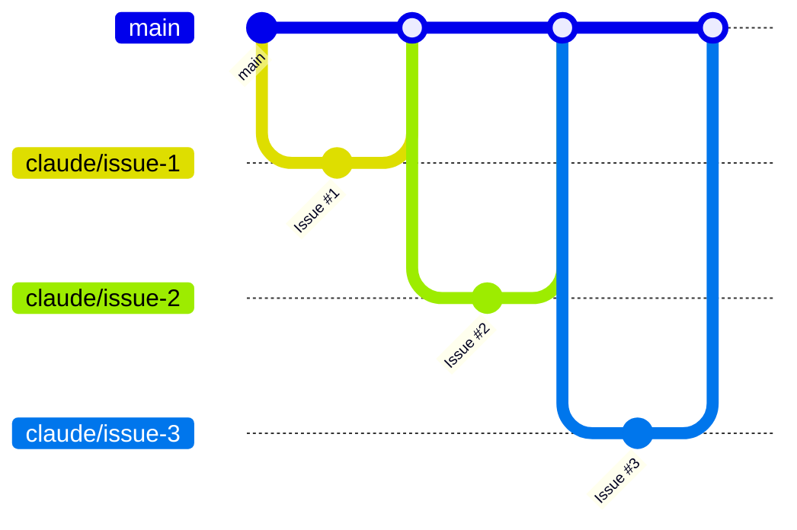

# Architecture

## Flow



Purple = Claude (runs as `claude[bot]`). Green = shell script. Yellow = build fix trigger.

## Branch strategy

Each Issue = one branch = one PR. Claude auto-merges on build pass.



---

## Detail: what runs what

The system has one workflow (`claude.yml`) with two jobs, and three agent `.md` files.

```
.github/workflows/claude.yml             <- Two jobs: implement + fix
.claude/agents/dev-planner-agent.md       <- Prompt for Planner sub-agent
.claude/agents/dev-generator-agent.md     <- Prompt for Generator sub-agent
.claude/agents/dev-evaluator-agent.md     <- Prompt for Evaluator sub-agent
```

### implement job

Triggered by: Issue with `@claude` in body, or Issue by `claude[bot]`.

Claude performs all steps end-to-end:

| Step | Who | Input | Output |
|------|-----|-------|--------|
| Inject @claude | Script | Issue body | Body with @claude |
| Planner | Claude sub-agent | Issue title + body | Plan JSON |
| Generator | Claude sub-agent | Plan + file path | Modified file |
| Evaluator | Claude sub-agent | Plan + generator report | pass/fail |
| Build + fix | Claude | Codebase | Clean build |
| Commit + push | Claude | Changes | Remote branch |
| PR create + merge | Claude | Branch | Merged PR (as `claude[bot]`) |
| Next Issue | Claude | `git log` | New Issue (as `claude[bot]`) |

### fix job

Triggered by: `@claude` comment on a PR (e.g. from a build failure reported externally).

| Step | Who | Input | Output |
|------|-----|-------|--------|
| Claude fixes code | Claude | PR comment with error | Fixed code |
| Re-build + merge | Script | PR branch | Merge, retry, or close (3x limit) |

### Why Claude creates the PR, merges, and creates the next Issue

`GITHUB_TOKEN` cannot trigger workflow runs on the same repository (GitHub's recursion prevention). Claude performs these actions as `claude[bot]`, which is a different actor and correctly triggers the `issues` event for the next cycle.
