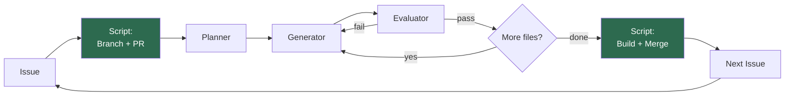

# Architecture

## Flow



Green = guaranteed by shell script.

## Script vs Agent responsibilities

| Step | Owner | Guaranteed? |
|------|-------|-------------|
| Branch + PR creation | Script | Yes |
| Inject `@claude` tag | Script | Yes |
| Planning | Planner agent | Best effort |
| Implementation | Generator agent | Best effort |
| Code review | Evaluator agent | Best effort |
| Build verification | Script | Yes |
| Auto-merge on pass | Script | Yes |
| Next Issue creation | Claude | Best effort |

## Trigger rules

| Creator | Condition | Result |
|---------|-----------|--------|
| Human | `@claude` in body | Fires |
| Human | No `@claude` | Skips |
| claude[bot] | Any | Fires (script injects `@claude` if missing) |

## Branch strategy

Each Issue gets one branch and one PR.

```
main
  |- claude/issue-1  ->  PR #2  ->  merged
  |- claude/issue-3  ->  PR #4  ->  merged
  |- claude/issue-5  ->  PR #6  ->  merged
  ...
```

Build passes: auto-merged (squash). Build fails: left open for manual review.
