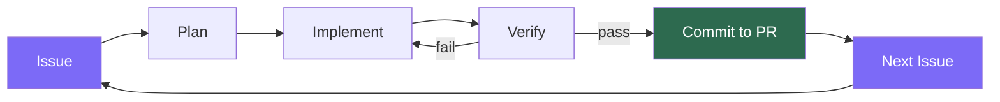
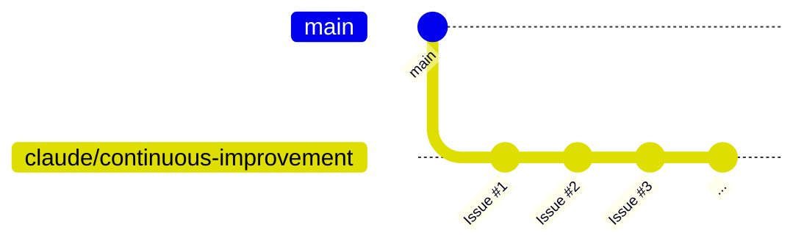

# Architecture

## Loop Flow



All commits go to one branch (`claude/continuous-improvement`) and one PR.  
The loop stops when you merge the PR to main.

## Trigger Rules

```mermaid
flowchart LR
    A{Who created?}
    A -->|Human| B{@claude in body?}
    B -->|Yes| C[Fires]
    B -->|No| D[Skip]
    A -->|claude bot| C

    style C fill:#2d6a4f,color:#fff
    style D fill:#d62828,color:#fff
```

## Branch Strategy



One branch. One PR. You merge when ready.
