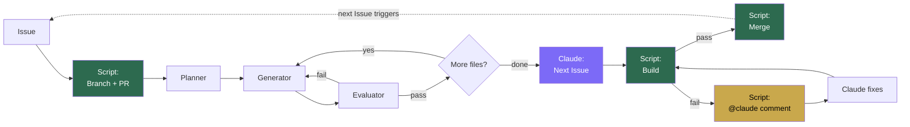
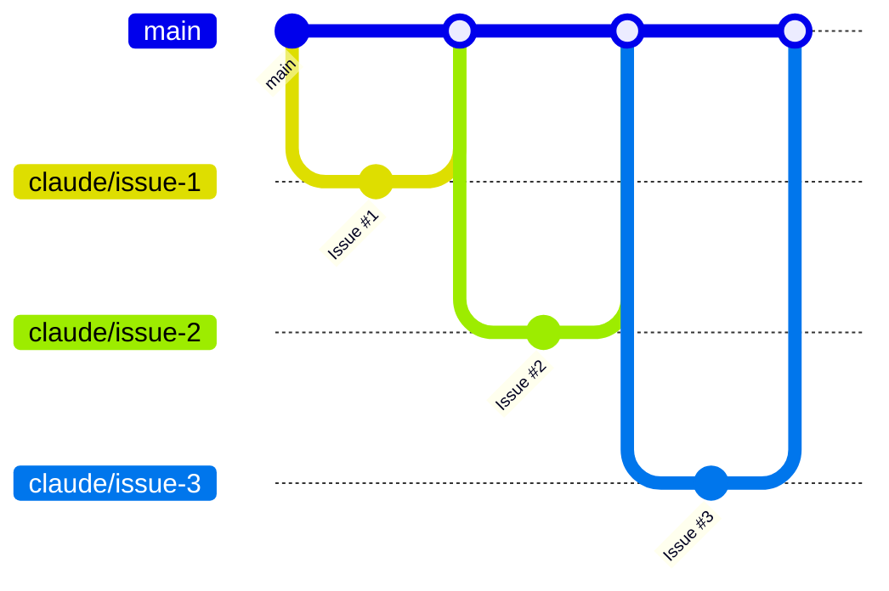

# Architecture

## Flow



Green = shell script (guaranteed). Purple = Claude. Yellow = build fix loop.

## Branch strategy

Each Issue = one branch = one PR. Auto-merged on build pass.



---

## Detail: what runs what

The system has one workflow (`claude.yml`) with two jobs, and three agent `.md` files.

```
.github/workflows/claude.yml            <- Shell scripts + Claude Code Action
.claude/agents/dev-planner-agent.md      <- Prompt for Planner sub-agent
.claude/agents/dev-generator-agent.md    <- Prompt for Generator sub-agent
.claude/agents/dev-evaluator-agent.md    <- Prompt for Evaluator sub-agent
```

The `.md` files are **not scripts**. They are prompts that Claude reads when invoking the Agent tool.

### implement job

Triggered by: Issue with `@claude` in body, or Issue by `claude[bot]`.

| # | What | Type | Input | Output |
|---|------|------|-------|--------|
| 1 | Create branch and PR | Shell script | Issue number, title | Branch + PR |
| 2 | Claude runs via `claude-code-action` | GitHub Action | `custom_instructions` | See sub-steps below |
| 3 | Build check + merge | Shell script | PR branch | Merge or `@claude` comment |

Inside step 2, Claude calls sub-agents:

| Sub-step | Agent file | Input | Output |
|----------|-----------|-------|--------|
| Planner | `dev-planner-agent.md` | Issue title + body | Plan JSON |
| Generator | `dev-generator-agent.md` | Plan + file path | Modified file |
| Evaluator | `dev-evaluator-agent.md` | Plan + generator report | pass/fail |
| Next Issue | Claude directly | `git log`, codebase | `gh issue create` (actor=`claude[bot]`) |

### fix job

Triggered by: `@claude` comment on a PR (from build failure).

| # | What | Type | Input | Output |
|---|------|------|-------|--------|
| 1 | Claude fixes code | GitHub Action | PR comment with error log | Fixed code |
| 2 | Re-build + merge | Shell script | PR branch | Merge, retry, or close (3x limit) |

### Why Claude creates the next Issue

`GITHUB_TOKEN` cannot trigger workflows on the same repo (GitHub recursion prevention).
Claude creates Issues as `claude[bot]`, which is a different actor and triggers the workflow.
