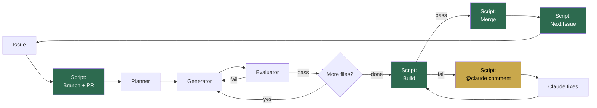

# Architecture

## Flow



Green = guaranteed by shell script.

## Two jobs

| Job | Trigger | Purpose |
|-----|---------|---------|
| `implement` | Issue created | Full cycle: branch, PR, implement, build, merge, next issue |
| `fix` | PR comment with `@claude` | Fix build failures, re-verify, merge, next issue |

## Key design: merge before next Issue

Next Issue is created **only after merge succeeds**.

```
Build fails  -> @claude comment on PR -> fix job runs -> re-build -> ...
Build passes -> merge -> next Issue created -> loop continues
```

No broken code enters main. No wasted iterations on a broken codebase.

## Script vs Agent responsibilities

| Step | Owner | Guaranteed? |
|------|-------|-------------|
| Branch + PR creation | Script | Yes |
| Inject `@claude` tag | Script | Yes |
| Planning | Planner agent | Best effort |
| Implementation | Generator agent | Best effort |
| Code review | Evaluator agent | Best effort |
| Build verification | Script | Yes |
| Build failure -> fix request | Script | Yes |
| Auto-merge on pass | Script | Yes |
| Next Issue creation | Script | Yes (only after merge) |

## Branch strategy

Each Issue gets one branch and one PR.

```
main
  |- claude/issue-1  ->  PR #2  ->  build pass  ->  merged
  |- claude/issue-3  ->  PR #4  ->  build fail  ->  claude fixes  ->  build pass  ->  merged
  |- claude/issue-5  ->  PR #6  ->  build pass  ->  merged
  ...
```
