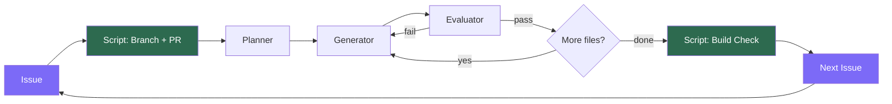
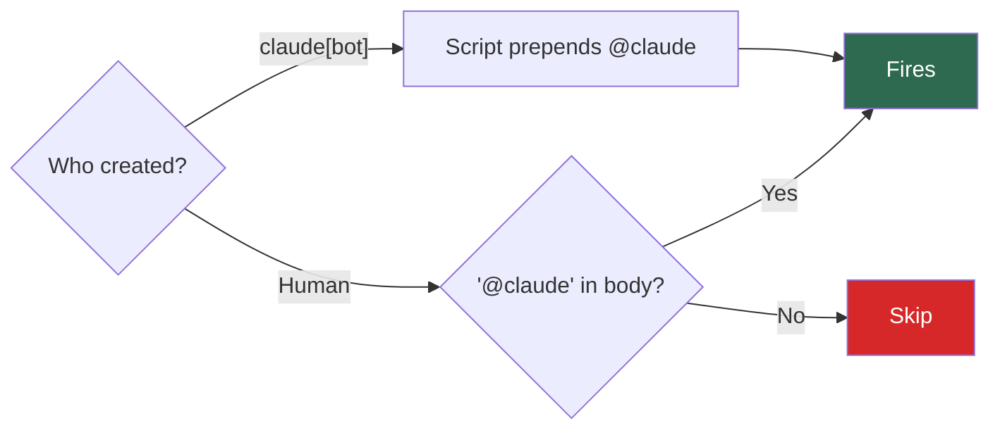
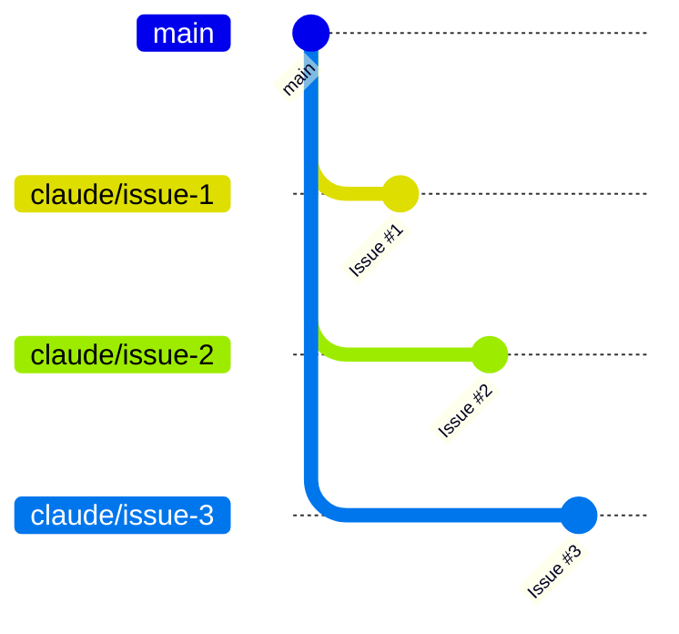

# Architecture

## Loop Flow

Green = guaranteed by shell scripts. Purple = triggers.

Each Issue gets its own branch and PR (1:1:1).

## What scripts guarantee vs what Claude handles

| Step | Who | Guaranteed? |
|------|-----|-------------|
| Branch + PR creation | Shell script | Yes |
| `@claude` tag injection | Shell script | Yes |
| Planning | Planner sub-agent | Best effort |
| Implementation | Generator sub-agent | Best effort |
| Code review | Evaluator sub-agent | Best effort |
| Build verification | Shell script | Yes |
| Next Issue creation | Claude | Best effort |

## Trigger Rules

Bot-created Issues without `@claude` are patched automatically by the setup script.

## Branch Strategy

Each Issue = one branch = one PR. Review and merge individually.
