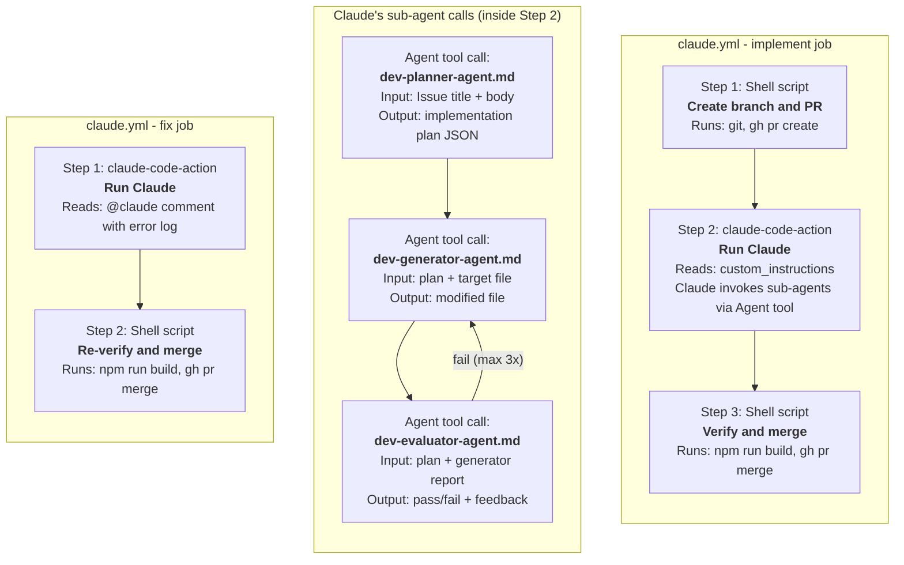
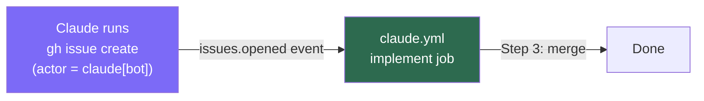
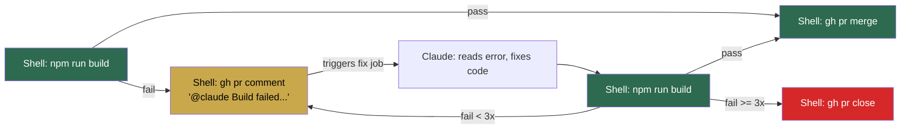
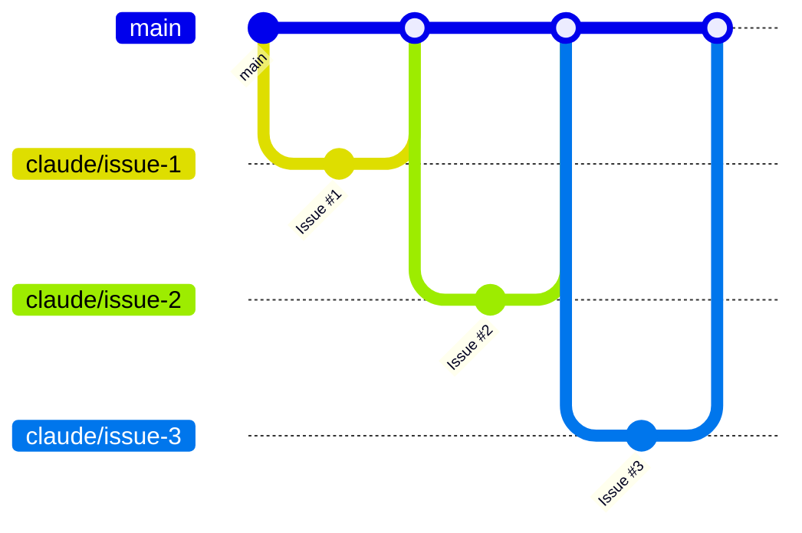

# Architecture

## System overview

The loop is driven by one workflow file (`claude.yml`) with two jobs, plus three agent definition files (`.md`).

```
.github/workflows/claude.yml       <- Shell scripts + Claude Code Action
.claude/agents/dev-planner-agent.md <- Agent prompt (invoked by Claude via Agent tool)
.claude/agents/dev-generator-agent.md
.claude/agents/dev-evaluator-agent.md
```

## What runs what



## Step-by-step execution

### implement job

Triggered by: Issue created with `@claude` in body, or by `claude[bot]`.

| # | What runs | Type | Input | Output |
|---|-----------|------|-------|--------|
| 1 | Shell script | `run:` block in YAML | Issue number, title, body | Branch `claude/issue-N` + PR created |
| 2a | `claude-code-action` calls Claude | GitHub Action | `custom_instructions` from YAML | Claude starts executing steps |
| 2b | Claude calls `dev-planner-agent.md` | Agent tool | Issue title + body | Implementation plan (JSON) |
| 2c | Claude calls `dev-generator-agent.md` | Agent tool | Plan JSON + file path | One file created/modified |
| 2d | Claude calls `dev-evaluator-agent.md` | Agent tool | Plan + generator output | `pass` or `fail` + feedback |
| 2e | If fail: Claude re-calls generator | Agent tool | Previous feedback | Fixed file (max 3 retries) |
| 2f | Claude runs `npm run build` | Bash tool | - | Build pass/fail |
| 2g | Claude runs `git commit && git push` | Bash tool | - | Changes pushed to PR branch |
| 2h | Claude runs `gh issue create` | Bash tool | `@claude` + description | Next Issue (actor=`claude[bot]`) |
| 3 | Shell script runs `npm run build` | `run:` block in YAML | PR branch | Build verification |
| 3a | If build passes | Shell script | - | `gh pr merge --squash` |
| 3b | If build fails | Shell script | Build error log | `@claude` comment on PR (triggers fix job) |

### fix job

Triggered by: `@claude` comment on a PR (typically from build failure).

| # | What runs | Type | Input | Output |
|---|-----------|------|-------|--------|
| 1 | `claude-code-action` calls Claude | GitHub Action | PR comment with error log | Claude fixes the code |
| 2 | Shell script runs `npm run build` | `run:` block in YAML | PR branch | Build verification |
| 2a | If build passes | Shell script | - | `gh pr merge --squash` |
| 2b | If build fails (< 3 times) | Shell script | Build error log | `@claude` comment (re-triggers fix job) |
| 2c | If build fails (>= 3 times) | Shell script | - | `gh pr close` (gives up) |

## How the loop continues



`GITHUB_TOKEN` cannot trigger workflows on the same repo (GitHub recursion prevention).
Claude creates the next Issue as `claude[bot]`, which is a different actor and does trigger the workflow.

## Agent definition files (.md)

These files live in `.claude/agents/` and are **not executed directly**.
Claude reads them when it calls the Agent tool with the agent name.

| File | When called | Called by | Tools available |
|------|-------------|-----------|-----------------|
| `dev-planner-agent.md` | Once per Issue | Claude (Step 2b) | Read, Glob, Grep, Bash |
| `dev-generator-agent.md` | Once per file | Claude (Step 2c) | Read, Write, Edit, Glob, Grep, Bash |
| `dev-evaluator-agent.md` | Once per file | Claude (Step 2d) | Read, Glob, Grep, Bash |

Each `.md` file contains:
- **Frontmatter**: agent name, description, available tools
- **System prompt**: role description, input/output format, rules

The agent definitions are prompts, not scripts. They instruct sub-agents on what to do.

## Build fix loop detail



## Branch strategy

Each Issue = one branch = one PR. Auto-merged on build pass.


