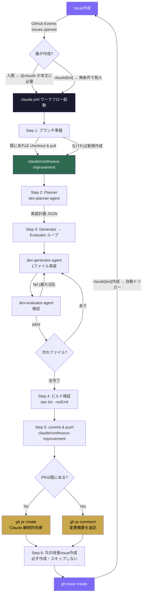
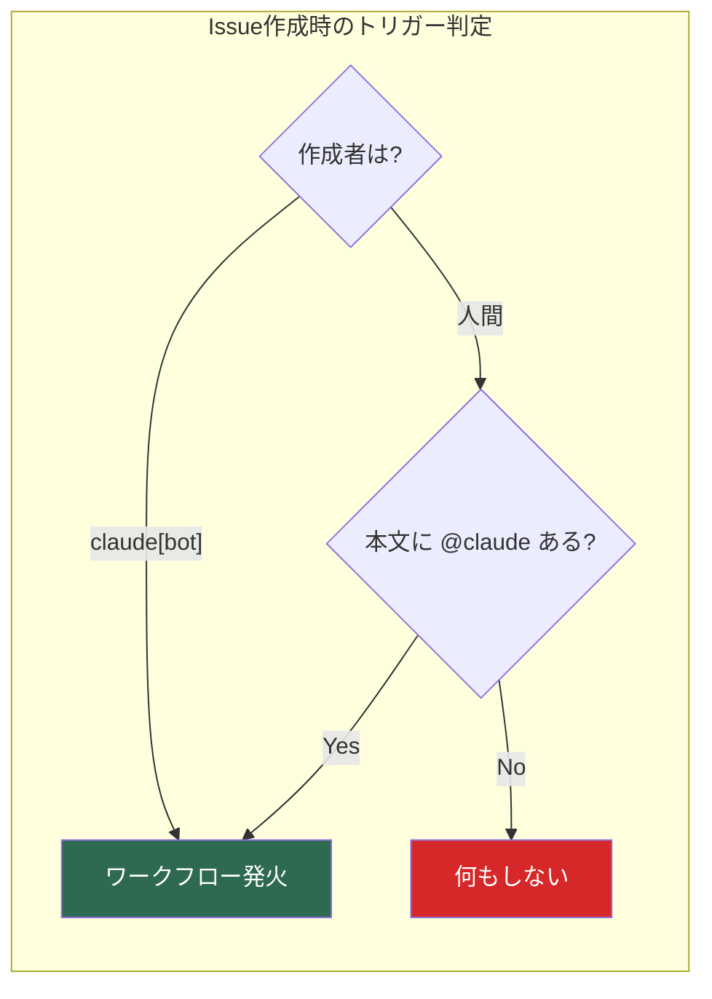
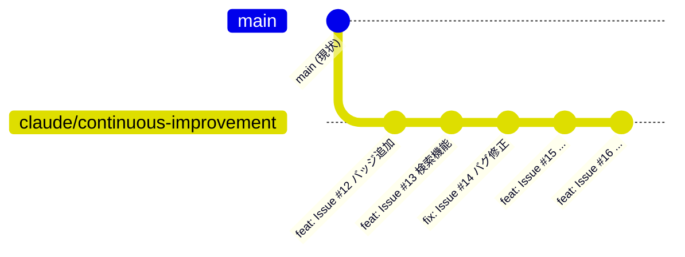
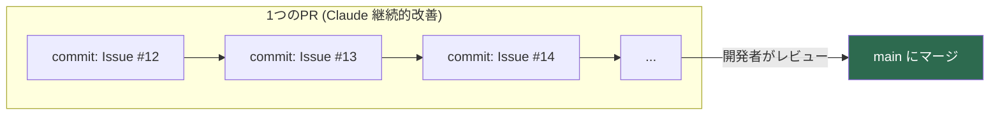
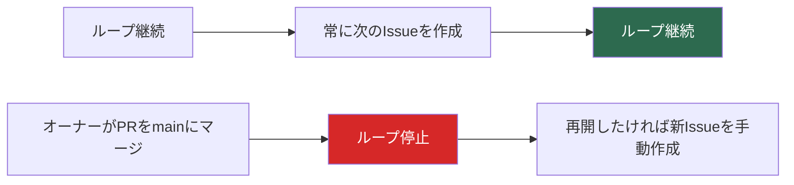

# Claude 無限改善ループ アーキテクチャ

## 全体フロー

## トリガー条件

- **人間が作ったIssue** → 本文に `@claude` が必要
- **claude[bot]が作ったIssue** → 無条件で自動トリガー（`@claude` 書き忘れでループが止まらない）

## ブランチ戦略 — 1ブランチ・1PR・複数コミット

- 全Issueの実装が **`claude/continuous-improvement` ブランチの1つのPR** にコミットされ続ける
- 各Issue = 1コミット。PRにどんどん積まれていく
- **開発者が確認してマージするまで止まらない**
- マージ後、再開したければ新しいIssueを作成

## 停止条件

- **止まらない**: 改善点がある限り永遠にループし続ける
- **唯一の停止**: オーナーがPRをmainにマージした時点でブランチが消えてループ終了
- **再開**: 新しいIssueを `@claude` 付きで作成すれば再スタート

## 必要なファイル（配布セット）

| ファイル | 役割 | 配布 |
|---------|------|------|
| `.github/workflows/claude.yml` | ワークフロー定義 (トリガー・Step 1-6) | 必須 |
| `.claude/agents/dev-planner-agent.md` | 実装計画を作成 | 必須 |
| `.claude/agents/dev-generator-agent.md` | 1ファイルずつコード実装 | 必須 |
| `.claude/agents/dev-evaluator-agent.md` | 実装結果を検証 | 必須 |
| `CLAUDE.md` | プロジェクト固有の規約 | 各自作成 |

## セットアップ（他のリポジトリで使う場合）

1. 上記4ファイルをリポジトリにコピー
2. [Claude GitHub App](https://github.com/apps/claude) をリポジトリにインストール
3. GitHub Secrets に `CLAUDE_CODE_OAUTH_TOKEN` を設定
4. `CLAUDE.md` をプロジェクトに合わせて作成
5. Issue を `@claude` 付きで作成 → ループ開始
